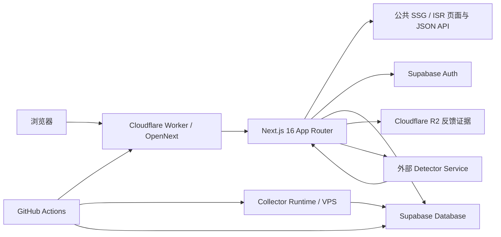

# PriceAI 全栈只读质量审计

> 审计日期：2026-07-15
> 审计快照：`main@b84adda71ad6f2eee7fe7079ea53448427cf5bf1`
> 生产站点：`https://priceai.cc`
> 生产发布：[Cloudflare Deploy #29403632694](https://github.com/dimthink/PriceAI/actions/runs/29403632694)
> 技术栈：Next.js 16.2.9、React 19.2.4、Cloudflare Workers、OpenNext 1.19.11、Supabase Auth / Database、R2
> 审计性质：全面、只读、证据驱动；不修改代码、配置、数据库、生产数据或部署状态
> 后续整改规划：[登录信任与全栈质量整改产品规划](planning/archive/pending/product/2026-07-15_priceai-login-trust-and-full-stack-quality-remediation-plan.md)

## 0. 审计口径

### 0.1 范围

本轮覆盖：

- Next.js App Router、Server Component、Client Component、Route Handler、缓存和 Next.js 16 `middleware` / `proxy` 约定。
- Supabase Auth、Google OAuth、PKCE、Cookie、Session 刷新、退出、账户中心和用户资源归属。
- Supabase Database migrations、RLS、service role、查询字段、分页、留存和 Egress。
- Cloudflare Workers、OpenNext、Durable Object、R2、缓存、日志和生产发布链。
- 检测服务、反馈证据、采集器、定时任务、GitHub Actions 和第三方模型调用。
- UI、移动端、键盘操作、焦点管理、URL 状态、列表返回、加载和错误状态。
- 依赖安全、版本兼容、测试、可观测性、维护成本和成本增长边界。

### 0.2 证据等级

| 标签 | 含义 |
| --- | --- |
| 已确认 | 当前代码、构建、公开线上行为或 GitHub Actions 能直接证明 |
| 高风险疑点 | 当前代码具备风险条件，但需要控制台、外部服务或特定异常条件才能确认实际发生 |
| 优化机会 | 当前功能可用，但存在成本、性能、体验或维护收益 |
| 需要控制台数据确认 | 无权访问 Cloudflare / Supabase / 第三方账单或策略配置，不推测当前数值 |

### 0.3 严重度

| 级别 | 定义 |
| --- | --- |
| P0 | 已造成或极可能立即造成大规模生产不可用、敏感数据泄露或不可逆破坏 |
| P1 | 直接影响认证、授权、隐私、核心任务、成本失控或生产发布，应在下一轮发布前或近期集中修复 |
| P2 | 影响体验、可访问性、性能、维护性和长期治理，应进入 1～2 周整改 |
| P3 | 低风险维护、状态口径和细节优化 |

### 0.4 方法与限制

本轮执行了以下只读工作：

1. 阅读仓库 `AGENTS.md`、项目文档、规划文档和 Next.js 16 随包文档。
2. 检查 `package.json`、Next/OpenNext/Cloudflare 配置、认证代码、账户 API、管理员认证、migrations、RLS 和 workflows。
3. 运行 lint、typecheck、build、performance guard 和仓库现有测试；均通过。
4. 运行 `npm audit --omit=dev` 和 `npm outdated --json`。
5. 检查生产公开页面、API、HTTP headers、OAuth 跳转和 Cookie 属性。
6. 检查 GitHub Actions 的 Quality、Supabase Preview、Cloudflare Deploy、Collector Runtime 和定时任务记录。

未执行：

- 未进入 Cloudflare、Supabase 或第三方 API 账单控制台读取私有用量。
- 未创建真实用户、未完成 Google OAuth、未触发真实检测任务或付费模型调用。
- 未写数据库、未运行 migration、未上传文件、未修改 WAF / Access / Rate Limiting。
- 未提交 commit、未部署。本轮开始时仓库原有 4 个未跟踪参数文件保持不动。

## 1. 执行摘要与总体健康度

总体健康度：**黄灯**。

项目可以正常构建和运行，公开浏览仍保持静态/ISR，基础安全响应头存在；但登录正确性、报告隐私、检测任务成本、生产发布链和采集运行时同步尚未达到成熟状态。

### 1.1 合并问题数量

| 级别 | 数量 | 结论 |
| --- | ---: | --- |
| P0 | 0 | 未发现已证实的紧急数据泄露、已利用 IDOR 或生产完全不可用 |
| P1 | 13 | 应在下一轮发布前或近期集中修复 |
| P2 | 12 | 应进入 1～2 周整改 |
| P3 | 3 | 低风险维护与口径漂移 |

### 1.2 分维度健康度

| 维度 | 健康度 | 主要结论 |
| --- | --- | --- |
| 构建与类型安全 | 绿 | lint、typecheck、build、performance guard、现有测试均通过 |
| 公开浏览与缓存 | 绿/黄 | 公共页面保持 SSG/ISR；动态 JSON API 的实际边缘命中不可观察 |
| 登录正确性 | 红 | 开放重定向、取消/失败循环、Session 刷新链缺口、双域登录态分裂 |
| 授权与数据隔离 | 黄 | 当前 DAL 都有 `user_id` 过滤，未发现 IDOR；但用户域完全依赖 service-role 代码约束 |
| 安全与隐私 | 黄/红 | 报告默认公开、删除生命周期缺失、OAuth 临时 Cookie 偏弱、Analytics 说明缺口明显 |
| 性能与成本 | 黄/红 | 公共 payload、动态 API、重复认证、检测轮询、采集调度、retention 和第三方预算未闭环 |
| UI 与可访问性 | 黄 | 弹窗焦点、搜索标签、详情返回、弱网和局部错误状态不完整 |
| 发布与采集稳定性 | 红 | 先生产 deploy 后 smoke，OpenNext DO warning，Collector Runtime 最近 7 次同步失败 |
| 可维护性与依赖 | 黄 | 超大型 Client Component、CI 不跑现有测试、2 个 moderate 生产依赖 advisory |

### 1.3 正面结论

- 公开搜索、比较、详情和指南仍免登录，登录没有让全站意外动态化。
- 线上首页与 `/channels` 返回 `x-nextjs-cache: HIT`。
- `/account` 使用 `private, no-cache, no-store` 并在未登录时进入登录流程。
- 用户鉴权使用 `supabase.auth.getUser()`，没有信任前端传入的 user ID。
- 当前账户查询都显式附带服务端 user ID，未确认现有账户 API 存在 IDOR。
- 敏感账户 API 使用 `no-store`。
- Google OAuth 已使用 PKCE S256。
- 管理员 Cookie 已设置 `HttpOnly`、`SameSite=Strict` 和生产 `Secure`。
- HSTS、CSP、`X-Content-Type-Options: nosniff`、frame deny 和 Referrer Policy 等基础响应头存在。
- 仓库未发现已提交的真实生产 secret。
- `npm audit --omit=dev` 未发现 high 或 critical 漏洞。

## 2. 当前系统、登录与权限架构

### 2.1 请求与数据流



### 2.2 公开浏览

```text
浏览器
-> Cloudflare Worker / OpenNext
-> 静态或 ISR 页面
-> 按需请求公开 JSON API
-> Supabase service-role 查询公共数据
```

当前公开页面不读取用户 Cookie，因而保留了 SSG/ISR 和 CDN 缓存能力。Header 在客户端挂载后请求 `/api/account/me` 决定显示“登录”还是“账户中心”。

### 2.3 Google OAuth

```text
/login 或 /auth/google
-> Supabase OAuth authorize + PKCE
-> Google
-> /auth/callback?code=...&next=...
-> exchangeCodeForSession
-> 写入 Supabase Auth Cookie
-> 回到 next
```

当前主要问题集中在 `next` 校验、取消/失败处理、`www` 与 apex、Cookie 属性以及后续 Session 刷新。

### 2.4 账户和普通用户授权

```text
Route / Server Component
-> getCurrentUser()
-> Supabase Auth getUser()
-> service-role DAL
-> .eq("user_id", authenticatedUser.id)
```

优点是当前代码不信任客户端 user ID；弱点是 service role 绕过 RLS，隔离完全依赖每个 DAL 调用都记得附加 user scope。

### 2.5 管理员授权

管理员认证与普通用户认证分离：管理员密码可来自数据库设置或 `ADMIN_PASSWORD`，成功后写入独立管理员 Cookie。当前数据库密码不匹配时仍会继续接受旧环境密码，因此“后台改密”不能完成完整撤销。

### 2.6 反馈、检测和文件

- 普通反馈写入 Supabase；高风险反馈要求登录，但登录校验发生在证据上传之后。
- 反馈证据写入 Cloudflare R2，当前没有未绑定对象 TTL 或删除联动。
- 检测任务由主站创建用户任务记录，再调用外部 Detector Service；状态 URL 由外部服务返回并存库。
- 检测报告页直接按 job ID 从 Detector Service 读取，未落实 owner 或公开状态。

## 3. 已确认 Bug 与风险清单

### 3.1 P1 总览

| ID | 问题 | 状态 | 分类 |
| --- | --- | --- | --- |
| P1-01 | OAuth 返回地址存在开放重定向 | 已确认 | 认证安全 |
| P1-02 | OAuth 取消、缺参数和交换失败可能形成重复登录循环 | 已确认 | 登录体验 / 稳定性 |
| P1-03 | Supabase Session 刷新链不完整 | 已确认 | 认证稳定性 |
| P1-04 | `www` 与 apex 形成两套 OAuth 回调和 Cookie 范围 | 已确认 | 认证正确性 |
| P1-05 | 检测报告默认公开，与既定隐私约定冲突 | 已确认 | 隐私 / 授权 |
| P1-06 | 检测配额竞态、僵尸任务和最多 90 次轮询放大 | 已确认 | 稳定性 / 成本 |
| P1-07 | 检测状态代理缺少 origin allowlist 和 timeout | 高风险疑点 | SSRF / 可用性 |
| P1-08 | 高风险反馈先上传后登录，草稿丢失并产生孤儿对象 | 已确认 | 交互 / 隐私 / 成本 |
| P1-09 | 公共动态 API 缓存命中不可观测，页面与请求负载偏大 | 已确认 / 高风险疑点 | 性能 / Egress |
| P1-10 | Cloudflare 发布、质量门禁和 OpenNext queue 验证未闭环 | 已确认 | 发布稳定性 |
| P1-11 | Collector Runtime 最近 7 次同步全部失败 | 已确认 | 数据稳定性 |
| P1-12 | 跨调度租约、retention apply 和第三方调用预算未闭环 | 已确认 / 代码推断 | 成本 / 容量 |
| P1-13 | 管理员修改密码后旧 `ADMIN_PASSWORD` 仍有效 | 已确认 | 管理员安全 |

### P1-01 OAuth 返回地址存在开放重定向

- 分类：认证安全
- 状态：已确认
- 严重程度：P1
- 证据：`src/lib/auth-paths.ts:3-5` 只拒绝非 `/` 开头和 `//`；`src/app/auth/callback/route.ts:21` 将结果传给 `new URL(next, origin)`。
- 影响范围：所有从登录、账户、反馈和检测入口进入 OAuth 的用户。
- 触发条件：回跳参数包含浏览器 URL parser 可解释为网络路径的异常分隔符或编码。
- 根因：用字符串前缀代替 URL 规范化和同源校验。
- 推荐方案：只接受规范化 pathname、query、hash；拒绝反斜杠、控制字符、重复编码和任何非同源结果；所有入口复用一个 helper。
- 预计收益：关闭 OAuth 后钓鱼和信任链劫持风险。
- 修复成本：低
- 修复风险：低；主要风险是误拒绝少数历史脏链接。
- 置信度：高
- 验证方法：本地 URL parser 单测、编码变体表、OAuth E2E，最终断言 Location 始终是 `priceai.cc` 站内路径。

### P1-02 OAuth 取消、缺参数和交换失败可能形成重复登录循环

- 分类：登录体验 / 稳定性
- 状态：已确认
- 严重程度：P1
- 证据：`src/app/auth/callback/route.ts:7-21` 不处理 OAuth `error`、缺 code 或 `exchangeCodeForSession` 失败；`src/app/login/page.tsx:13-20` 在无 `error` 时自动跳 Google。
- 影响范围：取消 Google 登录、授权失败、弱网、code 已消费或配置错误的用户。
- 触发条件：Google 返回错误、callback 缺参数或 Supabase 交换失败。
- 根因：callback 无结果状态模型，登录页以“无 error 即自动继续”作为默认。
- 推荐方案：显式映射 cancel、missing_code、exchange_failed、network_error、duplicate_callback；回到可见登录结果页，提供返回原页面和手动重试。
- 预计收益：消除无法退出的登录循环，降低登录流失和客服排障成本。
- 修复成本：低至中
- 修复风险：低
- 置信度：高
- 验证方法：登录取消、缺 code、交换失败、重复 callback 和弱网 E2E。

### P1-03 Supabase Session 刷新链不完整

- 分类：认证稳定性
- 状态：已确认
- 严重程度：P1
- 证据：`src/lib/auth.ts:34-40` 在 Server Component 无法写 Cookie 时吞掉异常；`src/middleware.ts:13-32` 只匹配旧 CSS，不承担认证刷新；当前 `@supabase/ssr` 指南要求页面不能写 Cookie 时由 middleware/proxy 更新响应 Cookie。
- 影响范围：长时间停留、Session 临近过期、直接访问受保护 Server Component 的登录用户。
- 触发条件：access token 过期且刷新发生在不能写 Cookie 的渲染上下文。
- 根因：登录 V1 只完成读取和 callback 写入，没有完成 Next.js 16 的刷新代理。
- 推荐方案：迁移为 Next.js 16 `proxy.ts`，只覆盖认证、账户和受保护 API；公共页面和静态资源不执行昂贵认证。
- 预计收益：减少随机退出、提前失效和重复刷新，同时保住公共缓存。
- 修复成本：中
- 修复风险：中；matcher 过宽会让公共页面动态化。
- 置信度：高
- 验证方法：过期 token E2E、直接访问账户页、刷新后 Set-Cookie、公共路由构建类型和 HTTP cache 回归。

### P1-04 `www` 与 apex 形成两套 OAuth 回调和 Cookie 范围

- 分类：认证正确性
- 状态：已确认
- 严重程度：P1
- 证据：2026-07-15 线上只读请求显示，`priceai.cc/auth/google` 生成 apex callback，`www.priceai.cc/auth/google` 生成 `www` callback；两侧 verifier Cookie 均未设置 `Domain`，因此为 host-only。
- 影响范围：从搜索引擎、历史链接或外部分享进入 `www` 的用户。
- 触发条件：在一个 host 发起登录，再进入另一个 host 的页面或 callback。
- 根因：认证前没有 canonical host 收敛，redirect origin 直接来自当前 request origin。
- 推荐方案：在进入 `/login`、`/auth/google` 和 callback 前将 `www` 统一 308 到 apex；Supabase redirect allowlist 与 Site URL 同步收敛。
- 预计收益：避免同一浏览器出现两套登录态和 callback 不匹配。
- 修复成本：低至中
- 修复风险：中；需确认 SEO、OAuth allowlist 和现有外链。
- 置信度：高
- 验证方法：双 host 登录矩阵、Cookie host 检查、canonical redirect 和 Supabase allowlist 控制台确认。

### P1-05 检测报告默认公开，与既定隐私约定冲突

- 分类：隐私 / 授权
- 状态：已确认
- 严重程度：P1
- 证据：`src/app/api-transit/detector/reports/[jobId]/page.tsx:33-61` 不读取用户或报告公开状态；`src/lib/transit-detector-report.ts:129-137` 仅凭 job ID 获取报告；登录产品规划 `docs/planning/archive/done/product/2026-06-29_priceai-user-login-system-product-plan.md:1106-1123` 要求默认私密。
- 影响范围：所有新旧检测报告及其中的 Base URL、模型、时间、异常证据和脱敏 key 信息。
- 触发条件：获得或猜到有效 job ID 并访问报告 URL。
- 根因：报告展示沿用外部检测服务的公开结果模式，未接入主站用户归属和可见性状态。
- 推荐方案：新报告默认 `private`；所有者读取；公开分享使用独立不可推导 token 和脱敏 DTO；支持撤销；历史报告先盘点再迁移。
- 预计收益：兑现账户与检测隐私承诺，降低敏感上下文泄露风险。
- 修复成本：中至高
- 修复风险：中；历史公开链接可能受影响。
- 置信度：高
- 验证方法：跨用户负向测试、匿名读取、创建/撤销分享、历史报告迁移清单。

### P1-06 检测配额竞态、僵尸任务和最多 90 次轮询放大

- 分类：稳定性 / 成本
- 状态：已确认
- 严重程度：P1
- 证据：`src/app/api/api-transit/detector/submit/route.ts:43-71` 先 count 再 insert；`src/lib/account.ts:152-199` 无事务或锁；状态只在轮询成功时更新；仓库没有任务超时 reaper；`src/components/TransitDetectorClient.tsx:428-433` 最多轮询 90 次。
- 影响范围：所有登录检测用户、Worker 请求量、Supabase 写入和外部检测成本。
- 触发条件：并发提交、后端长时间无响应、浏览器重复恢复轮询或任务记录停留在 queued/running。
- 根因：配额、任务创建、租约、心跳、超时和轮询分别实现，没有单一任务生命周期。
- 推荐方案：数据库 RPC/事务原子领取配额；增加 `expires_at`、心跳、终态和 reaper；轮询退避、页面隐藏降频、达到终态停止；幂等提交。
- 预计收益：阻止配额绕过，释放僵尸任务，减少 Worker / Auth / Detector 调用。
- 修复成本：中
- 修复风险：中；需定义超时后额度是否退还。
- 置信度：高
- 验证方法：并发提交测试、后端超时 stub、重复提交、跨标签恢复、请求数上限检查。

### P1-07 检测状态代理缺少 origin allowlist 和 timeout

- 分类：SSRF / 可用性
- 状态：高风险疑点
- 严重程度：P1
- 证据：`src/app/api/api-transit/detector/submit/route.ts:99-114` 接受检测服务返回的绝对 `status_url`；`src/app/api/api-transit/detector/status/[jobId]/route.ts:27-33` 直接服务端 fetch，没有 origin/path allowlist 或 timeout。
- 影响范围：主站 Worker、内部网络访问边界和检测状态接口。
- 触发条件：检测服务被攻陷、配置错误或返回恶意/异常绝对 URL。
- 根因：主站把外部服务返回的 URL 视为可信能力句柄。
- 推荐方案：只允许配置的 detector origin 和固定路径前缀；拒绝私网/保留地址；使用 `AbortSignal.timeout`、响应大小与 Content-Type 限制。
- 预计收益：降低二阶 SSRF、连接耗尽和无限等待风险。
- 修复成本：低至中
- 修复风险：低
- 置信度：高（代码风险）；未确认生产已被利用。
- 验证方法：使用本地 stub 返回不同 origin、私网地址、超时和超大响应，确认全部安全失败。

### P1-08 高风险反馈先上传后登录，草稿丢失并产生孤儿对象

- 分类：交互 / 隐私 / 成本
- 状态：已确认
- 严重程度：P1
- 证据：`src/components/ProductOffersPanel.tsx:1983-2120`、`2360-2479` 先逐张上传 `/api/feedback/evidence`，正式提交后才处理 `auth_required`；登录链接只保存 URL；中途失败前已上传对象不进入 UI 状态；`src/lib/feedback-evidence.ts:59-96` 只有 put/get，没有删除。
- 影响范围：商家质量、稳定性和风险反馈用户，以及 R2 Storage / Class A。
- 触发条件：未登录用户填写高风险反馈、部分文件上传失败或 OAuth 返回。
- 根因：身份要求放在最终提交层，上传和表单草稿没有事务 ID 或生命周期。
- 推荐方案：选择高风险类型时先登录；非敏感草稿存 sessionStorage 或短期服务端草稿；逐项保存上传结果；未绑定对象 TTL；撤销/删除联动清理。
- 预计收益：降低提交放弃和重复上传，控制 R2 孤儿对象。
- 修复成本：中
- 修复风险：中；草稿恢复必须避免持久化敏感数据。
- 置信度：高
- 验证方法：未登录反馈、OAuth 回跳、第二张上传失败、移除附件、草稿过期和对象清理测试。

### P1-09 公共动态 API 缓存命中不可观测，页面与请求负载偏大

- 分类：性能 / Egress
- 状态：已确认 / 高风险疑点
- 严重程度：P1
- 证据：2026-07-15 线上只读检查：首页传输约 21 KB、`/channels` 约 55 KB，二者均 `x-nextjs-cache: HIT`；`/api/explorer` 与 `/api/offers?limit=30` 没有 `cf-cache-status` 或 `age`，TTFB 约 1.07s / 0.87s；审计浏览器 Network 观察到动态 offers 链累计约 2.7s；`src/components/PriceExplorer.tsx:2448-2470` 存在多类独立 JSON fetch。
- 影响范围：公共浏览延迟、Cloudflare Worker CPU、Supabase Database Egress 和移动网络流量。
- 触发条件：进入高数据量频道、切换筛选、回到列表或边缘缓存未命中。
- 根因：静态 HTML 和动态 JSON 使用不同缓存链；缺少真实边缘命中可观测性；Client Component 数据请求较多。
- 推荐方案：先测真实 hit ratio；同一导航内请求去重；按用途收窄 payload；明确 Cloudflare Cache API/CDN header；避免登录 Cookie 进入公共缓存 key。
- 预计收益：降低 TTFB、Worker 请求和 Supabase Egress。
- 修复成本：中
- 修复风险：中；错误缓存会展示旧价格或用户数据。
- 置信度：线上响应高；“持续回源 Supabase”仍需控制台确认。
- 验证方法：Cloudflare Cache Analytics、重复请求的 `age`/hit、浏览器 Network、Supabase Egress 和 payload 对比。

### P1-10 Cloudflare 发布、质量门禁和 OpenNext queue 验证未闭环

- 分类：发布稳定性
- 状态：已确认
- 严重程度：P1
- 证据：`.github/workflows/deploy-cloudflare-worker.yml:104-110` lint/build 后直接 deploy，再 smoke；`.github/workflows/promote-cloudflare-worker.yml:35` 调用 package.json 中不存在的 `promote:cloudflare`；Quality 只跑 lint、performance guard、build，不跑现有测试或显式 typecheck；Deploy #29403632694 报告 `DOQueueHandler` 未导出、调用会运行时失败。
- 影响范围：所有生产发布、ISR/revalidation queue 和回滚流程。
- 触发条件：构建成功但运行时异常、queue 被调用、smoke 在生产切流后失败、需要 promotion 回滚。
- 根因：direct deploy 路径与 upload/preview/promote 设计并存但未接通；warning 未设为阻断；测试脚本不属于 CI 契约。
- 推荐方案：version upload -> preview URL -> smoke -> explicit promote；加 production environment、concurrency 和 SHA 校验；接通 `promote:cloudflare`；DO warning 和核心 Auth/权限测试作为阻断。
- 预计收益：失败版本在切流前被发现，回滚和发布证据可复用。
- 修复成本：中
- 修复风险：中；需验证 Wrangler/OpenNext version API。
- 置信度：高
- 验证方法：preview 失败不切生产、成功 promotion、queue revalidation smoke、回滚演练、CI 日志确认测试执行。

### P1-11 Collector Runtime 最近 7 次同步全部失败

- 分类：数据稳定性
- 状态：已确认
- 严重程度：P1
- 证据：GitHub Actions `Sync Collector Runtime` 最近 7 次运行均为 failure，范围为 #29110119626 至 #29348707627；最新失败是 `COLLECTOR_RUNTIME_SSH_HOST` 或私钥缺失；部署允许带理由绕过 runtime drift guard。
- 影响范围：持续写入 Supabase 的 API Transit / snapshot collector，与主站代码和 migrations 的一致性。
- 触发条件：主站合并 collector watchlist 变更，但远端 runtime 未同步或使用 drift override 发布。
- 根因：secret 归属和 runtime 发布责任未稳定，主站 deploy 与 collector deploy 仍是两条松耦合链。
- 推荐方案：修复 environment/repo secrets；远端保存 manifest SHA；watchlist 变更未同步时阻断生产；保留可审计、短时的 break-glass override。
- 预计收益：避免旧采集器覆盖新数据语义、重复调用或持续写错数据。
- 修复成本：中
- 修复风险：中；错误阻断可能延迟纯前端发布，应只对 watchlist 变更生效。
- 置信度：高
- 验证方法：同步 workflow 成功、远端 SHA 对齐、smoke 运行、故意制造 drift 验证阻断。

### P1-12 跨调度租约、retention apply 和第三方调用预算未闭环

- 分类：成本 / 容量 / 稳定性
- 状态：已确认 / 代码推断
- 严重程度：P1
- 证据：API Transit 主采集声明 VPS 每 10 分钟，GitHub 每 6 小时兜底，但无共享数据库 lease；snapshot workflow 每 30 分钟触发，dirty claim 为非原子读改写；retention migrations 默认 `dry_run=true`，仓库无定时 apply；`src/lib/trust-risk-reviewer.ts:87-160` 没有日预算、并发预算或明确输出 token 上限。
- 影响范围：Supabase 行数、WAL、Egress、GitHub 调度、Worker 请求、R2 和第三方模型/检测账单。
- 触发条件：VPS 与 GitHub 重叠、cooldown job 仍执行前置扫描、retention 长期只预览、模型预审请求量增长。
- 根因：各任务有局部 concurrency/cooldown，但没有跨运行 lease、统一预算和自动清理责任人。
- 推荐方案：共享数据库租约/claim；GitHub 仅在主节点失联时兜底；retention 单实例有限批次 apply；每类第三方调用设置日上限、并发、timeout、熔断和降级。
- 预计收益：防止重复调用和长期线性存储增长，使成本可预测。
- 修复成本：中至高
- 修复风险：中；租约错误可能漏采，retention 错误可能删多。
- 置信度：代码事实高；真实重复量和金额需控制台确认。
- 验证方法：并发调度测试、lease 冲突日志、retention dry-run/apply 记录、第三方预算熔断演练。

### P1-13 管理员修改密码后旧 `ADMIN_PASSWORD` 仍有效

- 分类：管理员安全
- 状态：已确认
- 严重程度：P1
- 证据：`src/lib/admin-auth.ts:83-93` 数据库密码不匹配后继续验证环境密码；`src/lib/admin-auth.ts:159-181` 将环境密码保留为兜底入口。
- 影响范围：`/admin` 登录和所有管理员写操作。
- 触发条件：管理员在后台修改密码，但旧环境密码仍被保留或已经泄露。
- 根因：日常凭据和 break-glass 凭据共用同一认证入口，且没有撤销优先级。
- 推荐方案：数据库 override 存在时彻底禁用环境密码；紧急入口迁到 Cloudflare Access 或独立审计流程；支持主动撤销和轮换。
- 预计收益：让改密真正完成凭据撤销，降低长期秘密暴露风险。
- 修复成本：低至中
- 修复风险：中；需避免管理员把自己锁在后台外。
- 置信度：高
- 验证方法：新旧密码矩阵、数据库 override 删除后的 break-glass 演练、审计日志。

### 3.2 P2 总览

| ID | 问题 | 状态 | 分类 |
| --- | --- | --- | --- |
| P2-01 | 用户域 RLS 无 ownership policy，隔离依赖 service-role DAL | 高风险疑点 | 授权 / 数据隔离 |
| P2-02 | OAuth verifier Cookie 属性偏弱且有效期约 400 天 | 已确认 | Cookie / Session |
| P2-03 | 普通用户退出错误被忽略，管理员没有退出入口 | 已确认 | 会话生命周期 |
| P2-04 | 多标签登录状态不同步，账户接口重复探测 | 已确认 | 登录体验 / 成本 |
| P2-05 | 账户查询多处 `select("*")`，字段和 Egress 过量 | 已确认 | 数据最小化 / 性能 |
| P2-06 | 缺少隐私政策、数据导出和账号删除闭环 | 已确认 | 隐私 / 合规 |
| P2-07 | 管理员限流依赖 isolate 内存，Access / WAF 状态未知 | 已确认 / 待控制台确认 | 管理员安全 |
| P2-08 | Dialog 焦点管理和核心搜索可访问性不完整 | 已确认 | 可访问性 |
| P2-09 | 详情返回、滚动位置和登录深链恢复不完整 | 已确认 | 交互连续性 |
| P2-10 | 搜索逐键路由、匿名 Turnstile 和首屏外图片提前加载 | 已确认 | 前端性能 |
| P2-11 | 账户、检测和后台缺少局部 loading / error 边界 | 已确认 | 稳定性 / 体验 |
| P2-12 | 超大型组件、依赖 advisory 和版本维护压力 | 已确认 / 优化机会 | 可维护性 / 依赖 |

### P2-01 用户域 RLS 无 ownership policy，隔离依赖 service-role DAL

- 分类：授权 / 数据隔离
- 状态：高风险疑点
- 严重程度：P2
- 证据：`supabase/migrations/20260704160000_user_login_mvp.sql:12-70` 对用户表启用 RLS，但仓库未找到 ownership policy；`src/lib/supabase.ts:12-30` 使用 service role，天然绕过 RLS。
- 影响范围：profile、反馈 followup 和检测任务等用户域数据。
- 触发条件：未来新增 DAL 查询时漏写 `.eq("user_id", user.id)`，或 DTO 误返回内部字段。
- 根因：V1 以服务端代码约束快速落地，没有把 ownership 约束下沉到数据库。
- 推荐方案：长期优先用户 JWT + `auth.uid()` policy；若保留 service role，至少建立强制 user scope 的 DAL/RPC 和跨用户负向测试。
- 预计收益：把“开发者记得过滤”升级为多层防线。
- 修复成本：中至高
- 修复风险：中；切换 JWT/RLS 可能改变后台和服务端查询。
- 置信度：高（代码结构）；当前未确认 IDOR。
- 验证方法：生产 policy 导出、migration drift 对比、A/B 用户夹具负向测试。

### P2-02 OAuth verifier Cookie 属性偏弱且有效期约 400 天

- 分类：Cookie / Session
- 状态：已确认
- 严重程度：P2
- 证据：线上 `/auth/google` 已使用 `code_challenge_method=s256`；verifier Cookie 只观察到 `Path=/`、`Max-Age=34560000` 和 `SameSite=lax`，未观察到显式 `Secure`、`HttpOnly`。
- 影响范围：所有 OAuth 发起流程。
- 触发条件：浏览器长期保留 verifier，或页面脚本能够读取临时认证材料。
- 根因：Supabase SSR client Cookie options 沿用默认值，未按 OAuth 临时 Cookie 生命周期收紧。
- 推荐方案：显式 `Secure + HttpOnly + SameSite=Lax + Path=/`；缩短有效期；成功、取消和失败后清理。
- 预计收益：缩小临时认证材料暴露窗口。
- 修复成本：低至中
- 修复风险：中；错误的 HttpOnly/清理逻辑可能破坏 PKCE 交换，必须按当前 Supabase SSR 版本验证。
- 置信度：高
- 验证方法：响应头、浏览器 Cookie、成功/取消/重复回调矩阵。

### P2-03 普通用户退出错误被忽略，管理员没有退出入口

- 分类：会话生命周期
- 状态：已确认
- 严重程度：P2
- 证据：`src/app/auth/signout/route.ts:4-7` 忽略 `signOut()` 错误并始终跳首页；默认 Supabase scope 为 global，但 UI 未说明；仓库未发现清除管理员 session Cookie 的 route/UI。
- 影响范围：普通用户所有设备会话和管理员会话。
- 触发条件：Supabase signout 失败、用户只想退出当前设备、管理员在共享或临时设备上操作。
- 根因：退出被当作单一跳转动作，没有产品化会话范围、失败和审计状态。
- 推荐方案：默认明确“退出当前设备”，另提供“退出全部设备”；检查错误；校验请求来源；管理员增加 POST logout 和审计事件。
- 预计收益：退出结果可信，降低会话残留和误解。
- 修复成本：低至中
- 修复风险：低
- 置信度：高
- 验证方法：local/global signout、网络失败、跨标签、管理员 Cookie 清除测试。

### P2-04 多标签登录状态不同步，账户接口重复探测

- 分类：登录体验 / 成本
- 状态：已确认
- 严重程度：P2
- 证据：`src/lib/account-client.ts:34-56` 只在组件挂载时请求 `/api/account/me`；未使用 `src/lib/auth-client.ts:5-9` 的浏览器 client 监听 auth 事件；Header 和 `TransitDetectorClient.tsx:258-275` 分别请求账户接口。
- 影响范围：所有公开页面 Header、检测页和多标签用户。
- 触发条件：一个标签页登录/退出，另一个标签页保持打开；检测页同时挂载 Header。
- 根因：账户状态是局部 hook，而不是共享 session 状态源。
- 推荐方案：单一 Auth Provider / SWR cache；监听 `SIGNED_IN`、`SIGNED_OUT`、`TOKEN_REFRESHED`；BroadcastChannel 或 Supabase 事件同步；服务端结果仅在受保护页作为 initial state。
- 预计收益：减少状态陈旧和重复 Auth/Worker 请求。
- 修复成本：中
- 修复风险：低
- 置信度：高
- 验证方法：多标签 E2E、单页面 Network 请求计数、token refresh 同步。

### P2-05 账户查询多处 `select("*")`，字段和 Egress 过量

- 分类：数据最小化 / 性能
- 状态：已确认
- 严重程度：P2
- 证据：`src/lib/account.ts:9-30`、`44-51`、`140-149` 多处全字段读取；mapper 涉及 contact、reviewer note、submitter IP、邮箱等内部或敏感字段。
- 影响范围：账户反馈、followup、检测任务列表和详情。
- 触发条件：用户打开账户页或轮询任务状态。
- 根因：V1 复用数据库 row 作为领域模型，缺少按视图定义的 DTO 列表。
- 推荐方案：每个账户视图显式列字段；后台内部字段使用独立 DTO；分页；对响应结构做契约测试。
- 预计收益：降低 Supabase Egress、服务端内存和误返回/日志泄露面。
- 修复成本：中
- 修复风险：低至中；需防止遗漏 UI 依赖字段。
- 置信度：高
- 验证方法：响应 schema、payload 字节、前后 Egress 和敏感字段负向断言。

### P2-06 缺少隐私政策、数据导出和账号删除闭环

- 分类：隐私 / 合规
- 状态：已确认
- 严重程度：P2
- 证据：`src/app/account/page.tsx:38-81` 只有账户摘要、反馈、检测和退出；`src/app/layout.tsx:86-87` 全站加载 Google Analytics 和 Umami；仓库没有公开隐私政策、数据导出和账号删除入口。
- 影响范围：所有登录用户、反馈贡献者和检测用户。
- 触发条件：用户想了解数据用途、导出数据、撤销 consent 或删除账户。
- 根因：登录功能先落地，数据权利和隐私文档未同步完成。
- 推荐方案：隐私政策说明 Auth、Analytics、R2、日志和 retention；账户设置提供导出/删除请求；定义 Auth 用户删除后 profile、反馈、followup 和检测记录的删除或匿名化。
- 预计收益：建立完整数据生命周期，降低信任和合规风险。
- 修复成本：中至高
- 修复风险：中；删除策略涉及证据保留和公开内容归属。
- 置信度：高
- 验证方法：端到端删除演练、导出样本、Analytics disclosure 审查和数据残留检查。

### P2-07 管理员限流依赖 isolate 内存，Access / WAF 状态未知

- 分类：管理员安全
- 状态：已确认 / 需要控制台数据确认
- 严重程度：P2
- 证据：`src/app/api/admin/login/route.ts:21`、`89-142` 使用进程内 `Map`；Cloudflare 多 isolate、重启和逐出不会共享计数。
- 影响范围：管理员登录接口。
- 触发条件：请求分散到不同 isolate 或 Worker 重启。
- 根因：应用层限流被当作唯一保护，但边缘运行时无共享内存。
- 推荐方案：Cloudflare Access 保护后台入口；WAF/Rate Limiting 为第一层；必要时 Durable Object/KV 记录持久计数；应用内 Map 仅做补充。
- 预计收益：提高暴力尝试和自动化滥用的真实阻断能力。
- 修复成本：中
- 修复风险：低；主要风险是误伤管理员。
- 置信度：高（代码）；控制台是否已有防护未知。
- 验证方法：控制台规则导出、多 isolate 压测、误伤和恢复流程。

### P2-08 Dialog 焦点管理和核心搜索可访问性不完整

- 分类：可访问性
- 状态：已确认
- 严重程度：P2
- 证据：`src/components/SiteHeader.tsx:170-192`、`src/components/FeedbackLink.tsx:457-516`、`src/components/ProductOffersPanel.tsx:1968-1981` 只处理 Escape/role，没有初始焦点、focus trap、背景 inert 和关闭后焦点恢复；线上核心搜索依赖 placeholder，placeholder 对比度约 2.60:1。
- 影响范围：键盘、读屏、低视力用户和所有弹窗流程。
- 触发条件：打开移动导航、反馈或证据 Dialog，或键盘定位搜索框。
- 根因：多个自建 portal 各自处理弹窗，没有共享可访问性 primitive。
- 推荐方案：统一 Dialog primitive；补 focus trap、恢复、背景隔离、滚动锁；搜索增加 label/aria-label 和 focus-visible；提高辅助文字对比度。
- 预计收益：关键反馈和登录相关操作可被键盘与辅助技术完成。
- 修复成本：中
- 修复风险：低
- 置信度：高
- 验证方法：axe、VoiceOver、只用键盘完成流程、焦点顺序和关闭后恢复测试。

### P2-09 详情返回、滚动位置和登录深链恢复不完整

- 分类：交互连续性
- 状态：已确认
- 严重程度：P2
- 证据：线上筛选进入详情再返回时 URL 筛选保留但滚动回顶部；`src/app/account/feedback/[feedbackId]/page.tsx:20-21` 未登录深链固定回 `/account/feedback`；反馈和检测 OAuth 只保留 URL，不保留局部操作状态。
- 影响范围：长列表比较用户、移动端用户和从账户深链进入的用户。
- 触发条件：列表滚动后进入详情、直接访问反馈详情、在操作中登录。
- 根因：URL 状态已有基础，但没有按 URL 保存 scroll anchor，也没有统一完整 return path 和草稿恢复协议。
- 推荐方案：按 URL/session history 保存滚动锚点；数据稳定后恢复；深链保留完整原路径；return 参数使用白名单；非敏感草稿独立恢复。
- 预计收益：减少重复查找和登录后的任务中断。
- 修复成本：中
- 修复风险：低至中；恢复时机不当会造成页面跳动。
- 置信度：高
- 验证方法：筛选 -> 滚动 -> 详情 -> 返回；新标签 fallback；账户深链登录 E2E。

### P2-10 搜索逐键路由、匿名 Turnstile 和首屏外图片提前加载

- 分类：前端性能
- 状态：已确认
- 严重程度：P2
- 证据：`src/components/TransitStationExplorer.tsx:155-168`、`TransitModelExplorer.tsx:78-87` 每次输入更新 router；`TransitDetectorClient.tsx:237-239` 仅按 site key 启用 Turnstile，未等登录；线上 Network 观察到四张首屏外赞助图初始下载，约 825 KB。
- 影响范围：中转搜索、未登录检测页、移动网络首屏。
- 触发条件：连续输入、匿名访问检测页、打开含赞助内容的长页面。
- 根因：输入状态和稳定 URL 状态未分离；第三方脚本按配置而非交互阶段加载；图片优先级未按视口区分。
- 推荐方案：150～300ms debounce；认证通过且接近提交时加载 Turnstile；首屏外图片 lazy、尺寸/DPR 限制，只有真正 LCP 图 priority。
- 预计收益：减少 RSC/路由工作、第三方脚本和首屏带宽竞争。
- 修复成本：低至中
- 修复风险：低
- 置信度：高
- 验证方法：输入请求数、未登录 Network、LCP/图片 waterfall 和移动端性能。

### P2-11 账户、检测和后台缺少局部 loading / error 边界

- 分类：稳定性 / 体验
- 状态：已确认
- 严重程度：P2
- 证据：存在根 `src/app/error.tsx` 和部分公共路由边界，但没有 `global-error.tsx`；账户、后台和检测主路径没有对应局部 `loading.tsx` / `error.tsx`。
- 影响范围：Supabase/Auth 慢请求、检测服务异常和后台读取失败。
- 触发条件：网络慢、数据库错误、外部服务超时或渲染异常。
- 根因：错误边界优先覆盖了公共数据页，新增账户和检测模块未同步补齐。
- 推荐方案：优先为 `/account/**`、detector、report 和 `/admin` 增加局部 loading/error/empty/forbidden；增加 `global-error.tsx` 作为最后防线。
- 预计收益：异常局部化，减少整页白屏和无限 loading。
- 修复成本：中
- 修复风险：低
- 置信度：高
- 验证方法：路由级故障注入、慢请求、404/403 和错误边界恢复测试。

### P2-12 超大型组件、依赖 advisory 和版本维护压力

- 分类：可维护性 / 依赖
- 状态：已确认 / 优化机会
- 严重程度：P2
- 证据：`AdminConsole.tsx` 约 11,407 行，`ProductOffersPanel.tsx` 2,811 行，`PriceExplorer.tsx` 2,778 行；`npm audit --omit=dev` 报告 Next 间接携带的 PostCSS advisory，共 2 个 moderate、0 high、0 critical；CI 没有统一 `npm test` 或显式 typecheck；OpenNext、Supabase SSR、Wrangler 等存在可用更新。
- 影响范围：后台、公共报价页、反馈、依赖升级和生产兼容性。
- 触发条件：修改大组件中的共享状态、升级 Next/OpenNext/Wrangler 或处理安全 advisory。
- 根因：功能按入口持续叠加，模块边界和测试契约未随规模增长；依赖升级缺少固定兼容矩阵。
- 推荐方案：先补行为测试，再按工作流拆分；建立统一 test/typecheck script；按 Next -> OpenNext -> Wrangler -> Supabase SSR 顺序小步升级；生成 SBOM 和许可证清单；不要采用 audit 建议的异常降级版本。
- 预计收益：降低变更回归和升级成本，及时处理 advisory。
- 修复成本：高
- 修复风险：中
- 置信度：高
- 验证方法：bundle/行为对比、CI 门禁、npm audit、OpenNext preview、许可证扫描。

### 3.3 P3 总览

| ID | 问题 | 状态 | 分类 |
| --- | --- | --- | --- |
| P3-01 | Header 登录状态存在轻微闪烁和潜在布局变化 | 优化机会 | UI |
| P3-02 | 账户 API 的 400/403/404/500 语义不统一 | 已确认 | API 口径 |
| P3-03 | 健康检查、官方价和 cooldown 任务存在低风险重复成本 | 优化机会 | 运维成本 |

### P3-01 Header 登录状态存在轻微闪烁和潜在布局变化

- 证据：`src/components/AuthButton.tsx:67-89` 首次显示“账户”，加载后切换为“登录”或“账户中心”。
- 影响：轻微文案和宽度变化；是否形成明显 CLS 需要真实用户数据。
- 建议：固定宽度 skeleton 或服务端仅在受保护页提供 initial state。
- 成本 / 风险：低 / 低
- 置信度：中
- 验证：Web Vitals CLS 和登录/未登录视觉回归。

### P3-02 账户 API 的 400/403/404/500 语义不统一

- 证据：部分 ownership 错误在 DAL 抛通用 Error，Route Handler 映射为 400 或 500；另一些详情接口返回 404。
- 影响：客户端、告警和日志难以区分参数错误、无权、资源不存在和服务端故障。
- 建议：统一不可枚举资源为 404，参数错误 400，认证 401，明确授权动作可用 403，系统错误 500；使用 typed domain error。
- 成本 / 风险：低至中 / 低
- 置信度：高
- 验证：API contract tests。

### P3-03 健康检查、官方价和 cooldown 任务存在低风险重复成本

- 证据：`src/app/api/health/route.ts:43-67` 一次深度检查执行 5 个 Supabase 查询；官方价周日 daily FX 与 weekly full 相邻运行，full 自身也读取 FX；snapshot cooldown 跳过前仍执行前置 feedback closeup 和扫描。
- 影响：低至中量级的数据库查询和第三方调用放大。
- 建议：健康检查分 shallow/deep；周日合并 FX；cooldown 先原子 claim 再做昂贵前置工作。
- 成本 / 风险：低至中 / 低
- 置信度：高
- 验证：调度次数、查询计数和 job duration 对比。

## 4. 登录专项风险与测试矩阵

### 4.1 专项结论

登录接入没有破坏公开浏览原则，当前主要风险不是“登录范围过大”，而是认证结果和身份操作的连续性不足：

- 回跳必须是严格同源的站内路径。
- OAuth 必须允许取消、失败、重试和返回，不得自动循环。
- Session 刷新只覆盖认证相关路径，不得让公共页面动态化。
- 高风险反馈应在上传前登录，OAuth 后恢复非敏感草稿。
- 检测任务和报告必须落实 owner、超时、私密和分享状态。
- 普通用户与管理员认证继续完全隔离。

### 4.2 测试矩阵

| 场景 | 前置条件 | 操作 | 预期结果 | 证据层级 |
| --- | --- | --- | --- | --- |
| 未登录公开浏览 | 无 Session | 访问首页、频道、官方价格、中转和详情 | 正常浏览，无登录跳转，缓存不退化 | E2E + HTTP |
| 正常登录 | 无 Session | 从公开页完成 OAuth | 返回原 URL，账户状态更新 | E2E |
| 登录取消 | 无 Session | 在 Google 取消 | 显示取消状态，可返回原页，不循环 | E2E |
| callback 缺 code | 无 Session | 访问缺参数 callback | 不建立 Session，显示可理解错误 | Route test |
| 交换失败 | 模拟 Supabase 错误 | OAuth 回跳 | 保留安全 return path，可重试 | Integration |
| 重复 callback | code 已消费 | 再次访问 callback | 不重复流程，安全失败 | Route test |
| 开放重定向变体 | 无 Session | 使用异常分隔符/编码 return path | 一律回退站内安全地址 | Unit + E2E |
| `www` / apex | 同一浏览器 | 从两个 host 发起认证 | 认证前统一 canonical host | HTTP + E2E |
| Session 过期 | 已登录 | 访问账户或提交受保护操作 | 刷新成功继续；失败则保留上下文重新登录 | Integration |
| 退出当前设备 | 已登录 | 点击退出当前设备 | 当前设备和标签页退出 | E2E |
| 退出全部设备 | 多设备登录 | 选择全局退出 | 影响范围与说明一致 | Integration |
| 多标签同步 | 两个标签页 | A 登录/退出，观察 B | B 在目标窗口同步 | E2E |
| 直接访问账户页 | 无 Session | 打开 `/account` | 安全登录并保留原路径 | E2E |
| 反馈详情深链 | 无 Session | 打开具体 feedback ID | 登录后回原详情，而非列表 | E2E |
| 高风险反馈草稿 | 未登录 | 填写后登录 | 恢复非敏感字段和已确认对象引用 | E2E |
| 部分上传失败 | 已登录 | 第二张图片失败 | 第一张仍显示成功，可重试失败项 | E2E |
| 访问他人反馈 | A/B 测试用户 | A 请求 B 的资源 | 统一不可枚举结果，无字段泄露 | Integration |
| 访问他人报告 | A/B 测试用户 | A 请求 B 私密报告 | 拒绝访问并记录授权失败 | Integration |
| 主动公开报告 | 所有者 | 创建分享后匿名访问 | 仅脱敏公开 DTO，可撤销 | Integration |
| Session 固定 | 登录前已有临时状态 | 登录成功 | 认证临时状态清理并更新会话 | Security test |
| 弱网 | 高延迟/丢包 | 登录、上传、提交、轮询 | 有 timeout、重试和幂等恢复 | E2E |
| 重复提交 | 双击/网络重放 | 提交反馈或检测 | 只产生一个有效业务结果 | Integration |
| 移动端 | 小屏/软键盘 | 完成登录、反馈、检测和退出 | 无遮挡，按钮可操作 | Mobile E2E |
| 键盘/读屏 | 辅助技术 | 完成登录和反馈 Dialog | 焦点可见、受控并恢复 | Accessibility |

自动化测试应使用本地 Supabase、测试项目、固定夹具或可控 stub；不得为了验证创建真实付费用户或消耗第三方额度。

## 5. UI、交互与可访问性审查

| 问题 | 对应 ID | 用户影响 | 建议 |
| --- | --- | --- | --- |
| 登录取消与失败没有稳定落点 | P1-02 | 用户无法退出登录链 | 可见结果页、返回原页、手动重试 |
| 登录后丢失反馈和检测上下文 | P1-08、P2-09 | 重填、重复上传、放弃操作 | 登录前置、非敏感草稿恢复 |
| 多标签状态不同步 | P2-04 | 显示旧登录态 | 统一 Auth Provider 和广播 |
| Dialog 焦点不完整 | P2-08 | 键盘/读屏进入背景内容 | 统一可访问 Dialog primitive |
| 核心搜索缺少稳定名称/对比不足 | P2-08 | 难识别和定位焦点 | label、focus-visible、对比度 |
| 返回详情丢滚动位置 | P2-09 | 长列表比较中断 | URL + scroll anchor 恢复 |
| 中转搜索逐键路由 | P2-10 | 弱网抖动和重复 RSC 工作 | debounce，输入/URL 状态分离 |
| 账户和检测缺少局部错误边界 | P2-11 | 异常时整页失败或无反馈 | loading/error/empty/forbidden |
| Header 状态闪烁 | P3-01 | 轻微布局变化 | 固定宽度 skeleton |

移动端主要按钮高度普遍接近 44px，大部分关键按钮有文字或 aria-label，这是当前正面基础。整改不需要重做视觉系统，应先补焦点、状态、恢复和弱网行为。

## 6. 性能审查

### 6.1 线上与构建证据

| 项目 | 证据 | 判断 |
| --- | --- | --- |
| 首页 | HTTP 200，约 21 KB 传输，`x-nextjs-cache: HIT` | 静态/ISR 正常 |
| `/channels` | HTTP 200，约 55 KB 传输，`x-nextjs-cache: HIT` | HTML/RSC 比首页明显更大 |
| `/api/explorer` | identity body 约 63,416 B；TTFB 约 1.07s | 动态 payload 和回源成本需优化 |
| `/api/offers?limit=30` | identity body 约 39,346 B；TTFB 约 0.87s | 需要分页、字段和缓存证据 |
| JSON cache | 有 `Cloudflare-CDN-Cache-Control: public, s-maxage=300`，但无 `cf-cache-status` / `age` | 声明可缓存，实际 edge hit 未证明 |
| 账户探测 | Header 与检测页分别请求 `/api/account/me` | 可去重 |
| 检测轮询 | 单任务最多 90 次 | 失败和弱网会放大 Worker/Auth 请求 |
| 图片 | 首屏外四张赞助图约 825 KB 初始下载 | 应 lazy 和限尺寸 |
| Client Component | AdminConsole 11k+ 行，两个公共核心组件各 2.7k+ 行 | hydration 和修改面较大 |

### 6.2 数据库和 API

- 账户查询多处 `select(*)`，应按视图显式列字段。
- 公共 JSON API 应记录实际 cache hit、回源字节和 Supabase Egress，而不是只检查 header。
- 列表和详情返回应使用 URL、短期客户端缓存和稳定滚动恢复，避免重拉和重算。
- API Transit 搜索应 debounce；Turnstile 在确认登录且接近提交时加载。
- 继续保持根布局不读取 Cookie，避免公共页面因登录状态整体动态化。

### 6.3 优先优化顺序

1. 建立动态 API edge hit / miss 证据。
2. 去重账户、offers 和检测状态请求。
3. 收窄 payload、显式字段和分页。
4. 修检测轮询、任务超时和跨调度 lease。
5. lazy 首屏外图片、debounce 路由搜索。
6. 行为测试稳定后再拆大型 Client Component。

## 7. 安全与隐私风险矩阵

| 风险域 | 结论 | 级别 | 防御建议 |
| --- | --- | --- | --- |
| OAuth return path | 已确认开放重定向条件 | P1 | 规范化、同源 allowlist |
| OAuth 取消/失败 | 已确认结果处理缺失 | P1 | 结果状态页、清理临时状态 |
| Session refresh | 已确认链路不完整 | P1 | 认证路径 `proxy.ts` |
| 报告权限 | 已确认默认公开 | P1 | owner、私密状态、独立 share token |
| 检测 status URL | 高风险疑点 | P1 | origin/path allowlist、私网阻断、timeout |
| 用户资源隔离 | 当前代码过滤正常，数据库防线弱 | P2 | RLS 或 scoped DAL/RPC |
| Cookie | PKCE 正常，临时 Cookie 属性偏弱 | P2 | Secure/HttpOnly/短 TTL/清理 |
| 管理员密码 | 旧环境密码不能撤销 | P1 | override 优先、Access break-glass |
| 管理员限流 | isolate 内存不足 | P2 | Access/WAF/持久计数 |
| 反馈上传 | 匿名写入和孤儿对象 | P1 | 登录前置、Turnstile、TTL、持久限流 |
| XSS/CSP | 基础 CSP 存在；PostCSS moderate advisory | P2 | 小步升级并验证输出路径 |
| 隐私权利 | 删除、导出和说明缺失 | P2 | 完整数据生命周期 |
| PII 日志 | 未确认生产泄露；DTO 和日志面偏宽 | P2 | 字段最小化、日志脱敏、采样 |
| secrets | 仓库未发现真实 secret | 正面 | 继续使用 GitHub/Cloudflare/Supabase secrets |

本报告仅提供防御性结论，不包含对生产系统的攻击操作步骤。

## 8. 依赖、测试与可维护性

### 8.1 当前版本

| 包 | 当前声明/安装 | 审计判断 |
| --- | --- | --- |
| Next.js | 16.2.9 | 最新 patch 16.2.10 可评估；升级必须同步 OpenNext/Wrangler 验证 |
| React / React DOM | 19.2.4 | 最新 patch 可评估，不是当前 P1 |
| OpenNext Cloudflare | 1.19.11 | 1.20.1 可评估；当前 DO export warning 必须先验证 |
| Wrangler | 4.99.0 | 最新版本跨度较大，不应直接跳升 |
| `@supabase/ssr` | 声明 ^0.12.0，安装 0.12.0 | 0.12.3 可小步评估，重点验证 Cookie/refresh |
| `@supabase/supabase-js` | 声明 ^2.105.3，安装 2.110.0 | 有 patch 更新，需跑 Auth/DB 契约测试 |

### 8.2 漏洞与许可证

- `npm audit --omit=dev`：2 个 moderate，0 high，0 critical。
- advisory 来源：Next 依赖的 PostCSS `<8.5.10` CSS stringify XSS advisory。
- audit 的自动修复建议出现不合理的 Next 9.3.3 降级，不应执行；应等待/选择兼容的 Next patch 并用实际 build/OpenNext preview 验证。
- 顶层 `package.json` 使用 `SEE LICENSE IN LICENSE`；本轮未形成 transitive license inventory，需要后续 SBOM / license scan。

### 8.3 测试和 CI

- 仓库已有 API Transit、反馈规则、分页、官方价 parser、API models、catalog 等测试脚本。
- Quality workflow 只运行 lint、performance guard 和 build。
- Cloudflare Deploy 只运行环境检查、lint、build、deploy、生产 smoke。
- 没有统一 `npm test` 和显式 `typecheck` script，也没有 Auth/权限/报告隐私 E2E。
- 结论：测试“存在且本地通过”，但尚未成为发布契约。

### 8.4 模块边界

优先拆分对象：

1. `AdminConsole.tsx`：按后台工作流拆数据容器和展示模块。
2. `ProductOffersPanel.tsx`：拆反馈、证据上传、Dialog、列表状态。
3. `PriceExplorer.tsx`：拆 URL 状态、请求缓存、列表/卡片展示。
4. Auth 状态：统一 provider，不再由每个组件直接请求账户接口。

拆分前必须先补行为等价测试；不建议以“降低行数”为目标一次性重写。

## 9. Cloudflare、Supabase 与第三方成本分析

### 9.1 结论

当前无法从公开证据得出真实月账单。最大增长项不是单纯 Workers 请求费，而是：

1. Supabase Database Egress 和动态 JSON 回源。
2. API Transit 高频追加数据、重复调度和 retention 未执行。
3. 外部 Detector / 模型预审调用。
4. 匿名 R2 写入和孤儿对象。
5. Workers Logs、OpenNext queue/cache 和高频轮询。

### 9.2 Cloudflare Workers

代码推断公式：

```text
月成本
= 基础套餐
+ max(月请求 - 套餐请求额度, 0) × 请求单价
+ max(月 CPU ms - 套餐 CPU 额度, 0) × CPU 单价
+ Workers Logs
+ Durable Objects
+ R2
```

按审计时官方定价口径，Workers Standard 可用以下估算式：

```text
$5
+ max(R - 10M, 0) / 1M × $0.30
+ max(CPUms - 30M, 0) / 1M × $0.02
+ Logs + R2 + Durable Objects
```

来源：[Cloudflare Workers pricing](https://developers.cloudflare.com/workers/platform/pricing/)。正式预算前必须重新核对最新价格。

需要控制台确认：

- Worker 月请求、按 route 拆分、CPU p50/p95/p99。
- HTML、RSC、`/api/explorer`、offers、账户和 detector route 的 hit/miss。
- Workers Logs events、采样率和错误量。
- Durable Object 请求、duration、错误和 `DOQueueHandler` 实际调用。

### 9.3 Supabase

公共 API Egress 估算：

```text
Database Egress
≈ 请求数 V × (1 - 实际缓存命中率 H) × 每次 Supabase 返回字节 B
```

若用 `/api/explorer` 当前 identity JSON 约 63,416 B 作为响应体代理：

| 月请求 | H=0% | H=50% | H=90% |
| ---: | ---: | ---: | ---: |
| 10 万 | 约 6.34 GB | 约 3.17 GB | 约 0.63 GB |
| 100 万 | 约 63.42 GB | 约 31.71 GB | 约 6.34 GB |
| 1000 万 | 约 634.16 GB | 约 317.08 GB | 约 63.42 GB |

该表只是响应体代理，不等于真实 Supabase Egress；需要用数据库查询返回字节和缓存层事实修正。

Supabase 成本估算：

```text
Auth = max(MAU - 套餐额度, 0) × MAU 单价
Egress = max(uncached GB - 额度, 0) × uncached 单价
       + max(cached GB - 额度, 0) × cached 单价
Disk = max(Database GB - included GB, 0) × GB-month 单价
```

审计时参考文档：[MAU](https://supabase.com/docs/guides/platform/manage-your-usage/monthly-active-users)、[Egress](https://supabase.com/docs/guides/platform/manage-your-usage/egress)、[Disk](https://supabase.com/docs/guides/platform/manage-your-usage/disk-size)、[Cost control](https://supabase.com/docs/guides/platform/cost-control)。

需要控制台确认：plan、Spend Cap、MAU、Auth/Database/Cached Egress、Database size、WAL、连接峰值、Top queries、表/索引体积和 migration drift。

### 9.4 R2

审计时官方免费/超额口径：

- 10 GB-month Storage。
- 100 万 Class A。
- 1000 万 Class B。
- 超额 Storage `$0.015/GB-month`。
- Class A `$4.50/百万`，Class B `$0.36/百万`。
- 互联网 Egress 免费。

```text
R2 月成本
= max(StorageGBMonth - 10, 0) × 0.015
+ max(ClassA - 1M, 0) / 1M × 4.50
+ max(ClassB - 10M, 0) / 1M × 0.36
```

来源：[Cloudflare R2 pricing](https://developers.cloudflare.com/r2/pricing/)。

当前重点不是 Supabase Storage，而是 R2 feedback evidence 和 OpenNext cache；仓库未发现 Supabase Storage API 使用，但需控制台确认无遗留 bucket。

### 9.5 调度和第三方 API

API Transit 名义频率：

```text
VPS 每 10 分钟 = 144 次/天
GitHub 每 6 小时 = 4 次/天
合计名义上限 = 148 次/天
```

若每轮 13 个来源，最低来源调用代理为：

```text
148 × 13 = 1,924 次/天
约 57,720 次/月
```

未包括分页、重试、模型目录、availability 和状态接口。只有在两套调度都实际执行且无共享 lease 时才达到该量级。

第三方模型/检测：

```text
月成本
= 请求数 × (输入 token × 输入单价 + 输出 token × 输出单价)
+ 图像计费
+ 失败重试
+ Detector CPU / 请求费用
```

必须补充 provider/model、日调用、tokens、图片数、失败率、重试倍数和账单。

### 9.6 GitHub Actions

GitHub public repo 使用标准 GitHub-hosted runner 通常不收取分钟费，但定时任务仍会消耗 Supabase、Workers 和第三方 API。来源：[GitHub Actions billing](https://docs.github.com/en/billing/concepts/product-billing/github-actions)。

## 10. P0 / P1 / P2 / P3 优先级总表

| 优先级 | ID | 整改主题 | 建议窗口 |
| --- | --- | --- | --- |
| P0 | 无 | 本轮无已确认 P0 | 持续监控 |
| P1 | P1-01～04 | OAuth、callback、Session、canonical host | 下一轮发布前 |
| P1 | P1-05～07 | 报告权限、检测配额、外部请求边界 | 下一轮发布前 / 近期 |
| P1 | P1-08 | 高风险反馈登录、草稿和孤儿对象 | 近期集中修复 |
| P1 | P1-09 | 公共动态 API、payload 和真实缓存命中 | 近期建立基线并修复 |
| P1 | P1-10～11 | Cloudflare 发布、OpenNext queue、Collector Runtime | 下一轮生产发布前 |
| P1 | P1-12 | lease、retention、第三方预算 | 近期集中治理 |
| P1 | P1-13 | 管理员凭据撤销 | 下一轮发布前 |
| P2 | P2-01～07 | 数据隔离、Cookie、退出、Auth 状态、隐私和管理员防护 | 1～2 周 |
| P2 | P2-08～11 | 可访问性、返回状态、前端性能和错误边界 | 1～2 周 |
| P2 | P2-12 | 组件、依赖、测试契约和许可证 | 1～2 周启动，持续实施 |
| P3 | P3-01～03 | 状态闪烁、API 语义和低风险调度成本 | 随后维护 |

## 11. 整改路线图

### 11.1 0～2 天

1. 修 OAuth return path、callback 错误状态和 canonical host。
2. 停止新检测报告默认公开。
3. 给 detector submit/status fetch 增加 timeout 和 origin/path allowlist。
4. 数据库管理员密码存在时禁用旧环境密码。
5. 将 Auth、报告权限和 callback 测试加入发布阻断清单。
6. 处理 `DOQueueHandler` warning；未验证前不把 warning 视为无害。
7. 修 Collector Runtime secrets 或明确阻断 watchlist 变更发布。

### 11.2 1～2 周

1. Next.js 16 `proxy.ts` 完成认证路径 Session refresh，并验证公共缓存。
2. 高风险反馈登录前置、草稿恢复、逐项上传和 R2 TTL。
3. 检测配额原子化、任务租约、超时回收和轮询退避。
4. 报告 owner、私密/公开状态、脱敏分享和撤销。
5. 统一 Auth Provider、多标签同步和账户请求去重。
6. 补 Dialog、搜索可访问性、滚动恢复和局部错误边界。
7. 接通 upload -> preview smoke -> promote，并让 CI 跑统一 test/typecheck。

### 11.3 1～2 月

1. 完成隐私政策、数据导出和账号删除。
2. 用户域采用 RLS 或强制 scoped DAL/RPC，多层验证隔离。
3. 建立动态 API cache hit、Supabase Egress、R2、Detector 和模型预算看板。
4. 跨调度数据库 lease、retention 单实例 apply 和告警闭环。
5. 按业务工作流拆大型 Client Component。
6. 小步升级 Next/OpenNext/Wrangler/Supabase，并处理 PostCSS advisory。
7. 建立月度 Auth、权限、发布、采集和成本复盘。

## 12. 暂时不应投入的过度优化

1. 不做全站强制登录或价格内容登录墙。
2. 不同时新增手机号、密码、更多 OAuth 和 Passkey。
3. 不在信任链完成前扩展收藏、评论、积分、签到和复杂合作方权限。
4. 不因本轮问题迁离 Supabase Auth 或重写整个身份系统。
5. 不在根布局读取 Cookie 来消除 Header 闪烁。
6. 不一次性重写所有大型组件。
7. 不在没有 Cache Analytics 前搭建复杂多层缓存。
8. 不在没有账单、token 和失败率数据前过度优化第三方模型单价。
9. 不对历史报告做无盘点的大规模可见性迁移。
10. 不把低风险依赖 patch 与 P1 登录整改混成一次高风险发布。

## 13. 仍缺少的数据与后续验证

### 13.1 Supabase Auth

- Site URL 和 redirect allowlist。
- JWT 生命周期、refresh token reuse interval。
- Google provider scopes。
- 用户删除状态和 Auth 审计日志。

### 13.2 Supabase Database

- 生产实际 RLS policies 和 migration drift。
- 当前 plan、Spend Cap、MAU、Egress、Disk/WAL 和连接峰值。
- Top queries、calls、rows 和平均返回字节。
- 用户域表、availability、detection 和 snapshot 的行数、体积和 retention candidates。
- Dashboard 或外部是否已有 retention job。

### 13.3 Cloudflare

- Worker 请求、CPU p50/p95/p99 和 route 分布。
- Cache API / CDN hit ratio，尤其 HTML/RSC、explorer、offers。
- Workers Logs events 和采样率。
- R2 Storage/Class A/Class B、孤儿 feedback 对象。
- Durable Object 请求、duration 和 error。
- Access、WAF、Rate Limiting、Turnstile 和预算告警配置。

### 13.4 Detector 与第三方

- Base URL 私网阻断、API Key 日志脱敏、任务 timeout 和 status URL 生成规则。
- 日任务量、各 mode 请求数/tokens/CPU、失败重试和费用上限。
- 模型预审 provider、单价、token、图片量和账单。

### 13.5 GitHub 与发布

- production Environment 保护和审批。
- secret 访问审计。
- preview/promote version 流程可用性。
- Collector Runtime 远端 manifest SHA 和真实服务状态。

## 附录 A：关键验证证据

### A.1 GitHub checks

- Cloudflare Deploy #29403632694：success，head SHA 为 `b84adda71ad6f2eee7fe7079ea53448427cf5bf1`。
- Quality #29403619904：success。
- Supabase Preview：success。
- Deploy 中仍出现 `DOQueueHandler` 未导出 warning。
- Collector Runtime 最近 7 次同步均为 failure。

### A.2 线上 HTTP

- 首页：200，`x-nextjs-cache: HIT`。
- `/channels`：200，`x-nextjs-cache: HIT`。
- `/account`：307，`private, no-cache, no-store`。
- `/api/explorer`、`/api/offers?limit=30`：`Cloudflare-CDN-Cache-Control: public, s-maxage=300`，未观察到 `cf-cache-status` / `age`。
- apex 和 `www` 分别生成各自 OAuth callback 和 host-only verifier Cookie。

### A.3 本地质量检查

- lint：通过。
- typecheck：通过。
- Next build：通过。
- Cloudflare/OpenNext build：通过。
- performance guard：通过。
- 仓库现有脚本测试：通过。
- `npm audit --omit=dev`：2 moderate，0 high，0 critical。

## 附录 B：文档关系

| 文档 | 作用 |
| --- | --- |
| 本文 | 保存 2026-07-15 只读审计事实、证据和严重度 |
| [登录信任与全栈质量整改产品规划](planning/archive/pending/product/2026-07-15_priceai-login-trust-and-full-stack-quality-remediation-plan.md) | 将审计问题转为用户旅程、功能模块和整改路线 |
| [工程质量与可维护性规划](planning/archive/pending/product/2026-07-10_priceai-engineering-quality-and-maintainability-plan.md) | 承接测试、发布门禁、契约和模块拆分 |
| [基础设施容量与成本治理规划](planning/archive/in-progress/product/2026-07-14_priceai-infrastructure-capacity-traffic-and-cost-governance-plan.md) | 承接 Cloudflare、Supabase、R2、日志和容量治理 |

## 执行记录

| 日期 | 阶段 | 状态 | 说明 |
| --- | --- | --- | --- |
| 2026-07-16 | 审计整改本地收尾 | 代码可闭环项已完成，待外部确认 | 本地已补齐认证/隐私/任务/反馈/缓存/留存/质量门禁和主要交互整改；未提交、未部署、未应用 migration。Collector Runtime SSH secrets、控制台用量、Access/WAF、真实 OAuth 与生产 RLS 不属于本地代码可确认范围。 |
| 2026-07-16 | 最终残余复核与修复 | 未发现 P0；本地代码残余项已清零 | snapshot 耦合、缓存键绕过、分享错误语义、证据 URL、敏感图片缓存、lease 续租、跨 isolate 上传配额均已修复；历史 migration 空库问题采用独立 recovery baseline，隔离 Docker 空库执行通过。 |
| 2026-07-15 | 全栈只读审计 | 已完成 | 基于 `main@b84adda`、生产公开证据、GitHub Actions、本地构建/测试和代码检查形成；未修改系统 |
| 2026-07-15 | 审计文档归档 | 已完成 | 将审计结论单独保存，与产品整改规划互相链接；未提交 commit |

## 最终复核结论（2026-07-16）

当前审计清单中能够仅靠仓库代码、配置、测试和本地隔离环境闭环的问题已经完成。没有发现仍未处理的 P0，也没有仍待编码的 P1/P2 审计项。

以下事项不是“代码未修复”，而是必须在发布后或控制台用真实证据确认：

- Supabase GitHub Integration 实际应用新增 migrations，生产 RLS/RPC 与仓库一致。
- Cloudflare Cache API、Access、WAF、Rate Limiting、R2 和预算告警的生产行为与用量。
- Google OAuth 取消、重复回调、Session 过期和多标签同步的真实环境回归。
- Collector Runtime 补齐 `COLLECTOR_RUNTIME_SSH_HOST`、`COLLECTOR_RUNTIME_SSH_PRIVATE_KEY` 后恢复同步。
- Detector 第三方的数据留存、密钥日志、删除能力和实际费用。
- Cloudflare/Supabase 的真实请求、CPU、Egress、Storage、MAU、连接峰值与账单临界点。

`supabase/migrations` 的历史链仍不应直接在空库从第一份文件执行；该风险已通过 [Supabase 空库恢复 baseline](supabase-disaster-recovery-baseline.md) 建立受支持恢复路径。未来若要让标准 `supabase db reset` 纯 migration 重放，需要单独做历史 squash 和 migration history 对齐，不应混入日常生产发布。
